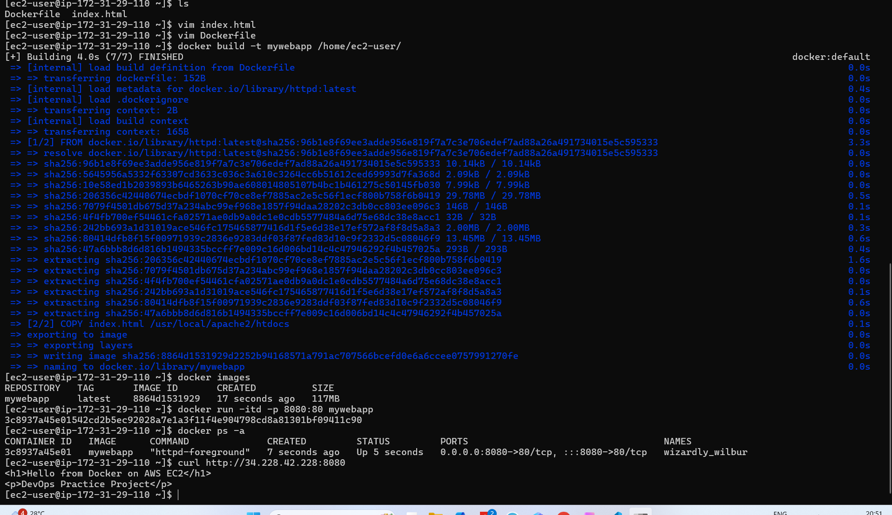
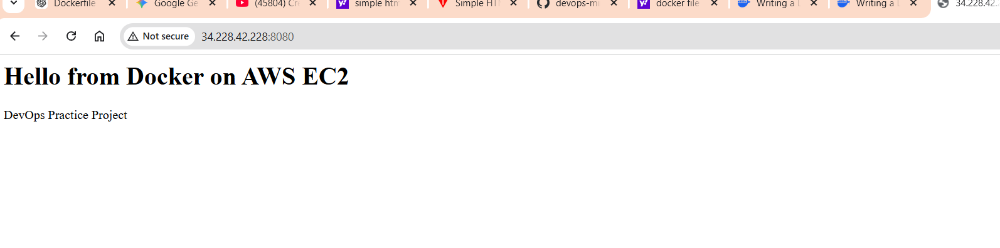

# Deploy Web App using Docker on AWS EC2

## Project Overview

This project demonstrates how to deploy a simple web application using Docker on an AWS EC2 instance.

The application is containerized using Docker and served through Apache HTTP Server.

---

## Technologies Used

* AWS EC2
* Docker
* Apache HTTP Server
* Linux

---

## Project Architecture

User → EC2 Instance → Docker Container → Apache Server → HTML Page

---

## Steps Performed

### 1. Create Simple HTML Page

```html
<h1>Hello from Docker on AWS EC2</h1>
<p>DevOps Practice Project</p>
```

### 2. Create Dockerfile

```
FROM httpd:latest
COPY index.html /usr/local/apache2/htdocs/
```

### 3. Build Docker Image

```
docker build -t mywebapp .
```

### 4. Run Docker Container

```
docker run -d -p 8080:80 mywebapp
```

### 5. Access Application

```
http://EC2-PUBLIC-IP:8080
```

---

## Screenshots

### Docker Image Build && Running Container



### 


### Application Output



---

## Learning Outcome

* Docker image creation
* Container deployment
* Port mapping
* Deploying containerized applications in cloud

---

