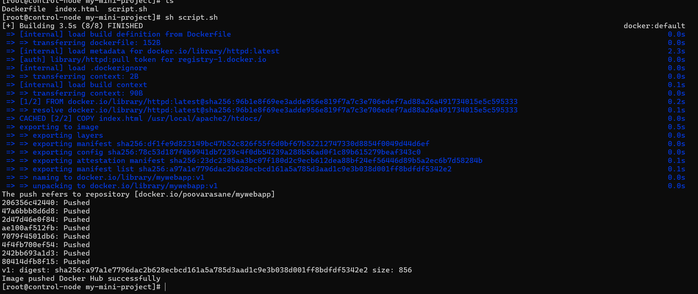
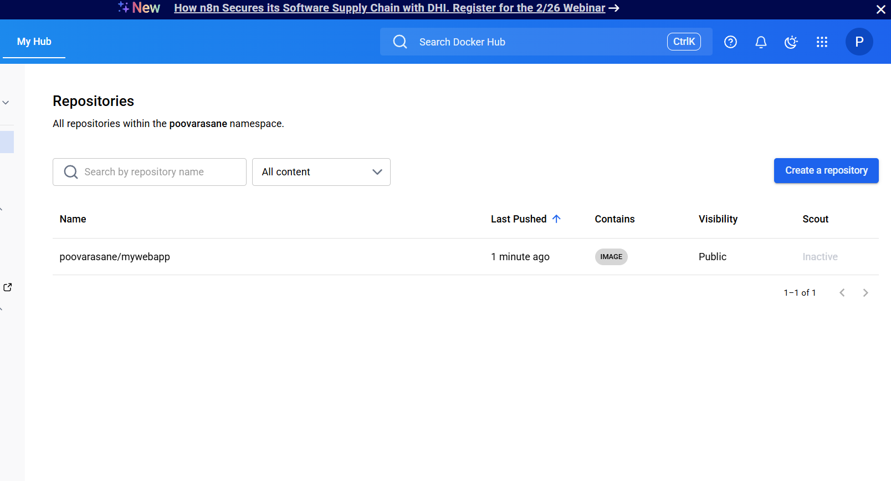

# Docker Image Push Automation

## Project Overview

This project demonstrates how to automate the Docker image publishing process using a shell script.

The script builds a Docker image from a Dockerfile, tags it with a Docker Hub repository name, and pushes it automatically to Docker Hub.

This simulates the **image publishing stage of a CI/CD pipeline** used in DevOps workflows.

---

## Technologies Used

* Docker
* Shell Scripting
* Linux
* Docker Hub

---

## Project Workflow

Application Code → Dockerfile → Build Image → Tag Image → Push to Docker Hub

---

## Project Structure

```
docker-image-push-automation
│
├── Dockerfile
├── index.html
├── script.sh
├── README.md
└── screenshots
```

---

## Step 1: Build Docker Image

The Dockerfile defines a simple Apache web server container.

Example Dockerfile:

```
FROM httpd:latest
COPY index.html /usr/local/apache2/htdocs/
```

---

## Step 2: Automation Script

A shell script automates the workflow:

* Build the Docker image
* Tag the image with Docker Hub repository
* Push the image to Docker Hub

Example script execution:

```
sh script.sh
```

---

## Step 3: Docker Hub Repository

The image is pushed to Docker Hub repository:

```
poovarasane/mywebapp:v1
```

---

## Screenshots

### Docker Image Push from Terminal



### Docker Hub Repository



---

## Learning Outcomes

* Docker image creation
* Docker image tagging
* Docker Hub authentication
* Automating container publishing using shell scripting
* Understanding container registry workflow

---

