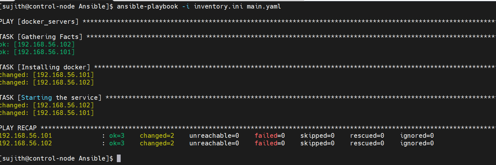

# Ansible Infrastructure Setup – Install Docker on Multiple Servers

## Project Overview

This project demonstrates how to automate infrastructure configuration using **Ansible**.
The playbook installs Docker, starts the Docker service, and enables it on multiple Linux servers.

The automation is executed from an **Ansible Control Node** and applied to multiple target nodes.

---

## Technologies Used

* Ansible
* Linux
* SSH
* Infrastructure Automation

---

## Architecture

Control Node → Managed Nodes

```
Control Node
     │
     │ SSH
     ▼
 ┌───────────────┐
 │ 192.168.56.101│
 │ Docker Installed
 └───────────────┘

 ┌───────────────┐
 │ 192.168.56.102│
 │ Docker Installed
 └───────────────┘
```

---

## Project Files

| File            | Description                          |
| --------------- | ------------------------------------ |
| `inventory.ini` | List of managed nodes                |
| `main.yaml`     | Ansible playbook to configure Docker |
| `outputs/`      | Execution screenshots                |

---

## Inventory Configuration

```
[docker_servers]
192.168.56.101
192.168.56.102
```

---

## Playbook Tasks

The playbook performs the following tasks:

1. Install Docker
2. Start Docker service
3. Enable Docker service at system startup

---

## Running the Playbook

Run the following command from the control node:

```
ansible-playbook -i inventory.ini main.yaml
```

---

## Execution Output



---

## Learning Outcome

* Understanding Ansible inventory
* Writing Ansible playbooks
* Automating infrastructure configuration
* Managing multiple servers using Ansible
