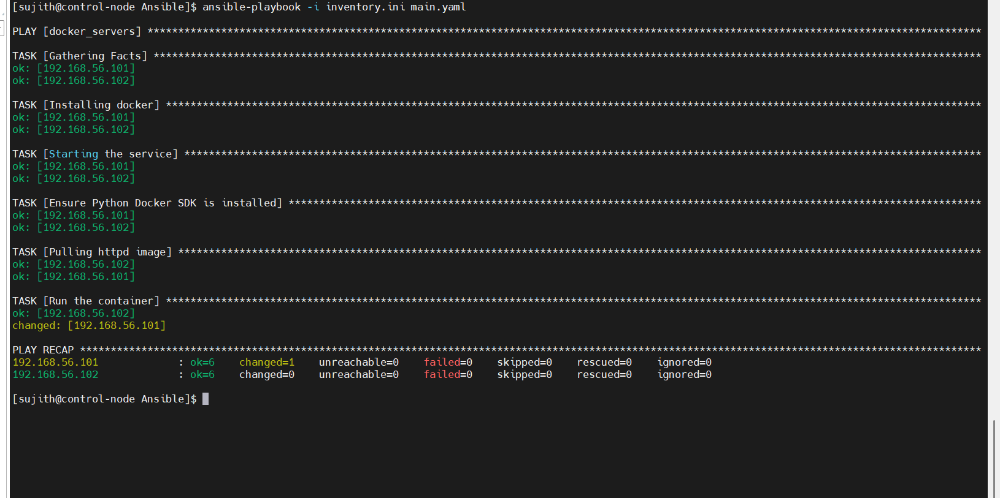
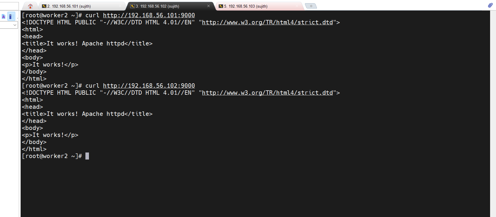

# Deploy Docker Container using Ansible

## Project Overview

This project demonstrates how to automate application deployment using **Ansible and Docker**.

The Ansible playbook installs Docker, installs required Python dependencies, pulls a Docker image, and runs a container automatically on multiple servers.

## Technologies Used

* Ansible
* Docker
* Linux
* Python (Docker SDK)

## Infrastructure Setup

Control Node → Worker Nodes

```
Control Node (Ansible)
        │
        │ SSH
        ▼
 ┌───────────────┐
 │ 192.168.56.101│
 │ Docker + httpd
 └───────────────┘

 ┌───────────────┐
 │ 192.168.56.102│
 │ Docker + httpd
 └───────────────┘
```

## Project Files

| File          | Description                               |
| ------------- | ----------------------------------------- |
| inventory.ini | Contains worker node IP addresses         |
| main.yaml     | Ansible playbook for container deployment |
| screenshots   | Execution proof                           |

## Ansible Playbook Tasks

The playbook performs the following steps:

1. Install Docker
2. Start and enable Docker service
3. Install Python Docker SDK dependencies
4. Pull Apache httpd Docker image
5. Run container and expose port 9000

## Running the Playbook

Run the following command from the control node:

```
ansible-playbook -i inventory.ini main.yaml
```

## Container Access

The Apache container runs on:

```
http://SERVER-IP:9000
```

Example:

```
http://192.168.56.101:9000
http://192.168.56.102:9000
```

## Verification

Example verification using curl:

```
curl http://192.168.56.101:9000
```

Output:

```
It works! Apache httpd
```

## Screenshots

### Ansible Playbook Execution



### Application Verification



## Learning Outcome

* Infrastructure automation using Ansible
* Docker container deployment
* Troubleshooting Ansible module dependencies
* Automated application deployment on multiple servers


## Troubleshooting / Issues Faced

During the deployment, a few issues were encountered and resolved.

### Issue 1: Missing Python `requests` Library

**Error**

```
ModuleNotFoundError: No module named 'requests'
```

**Reason**

The Ansible Docker modules require the Python `requests` library on the managed nodes to communicate with the Docker API.

**Solution**

Installed the required library on worker nodes using pip.

```
pip3 install requests
```

---

### Issue 2: Docker SDK Compatibility Error

**Error**

```
Error connecting: Not supported URL scheme http+docker
```

**Reason**

The latest Python Docker SDK caused compatibility issues with Ansible Docker modules.

**Solution**

Pinned a compatible version of the `requests` library in the Ansible playbook.

```
- name: Ensure Python Docker SDK is installed
  pip:
    name:
      - docker
      - requests==2.28.1
    state: present
```

This ensured stable communication between Ansible and the Docker daemon.

---

### Issue 3: Python Dependency Requirement for Docker Modules

**Reason**

Ansible Docker modules require Python libraries on the managed nodes.

Required dependencies:

* docker (Python Docker SDK)
* requests

**Solution**

Installed dependencies automatically in the playbook before pulling the container image.
